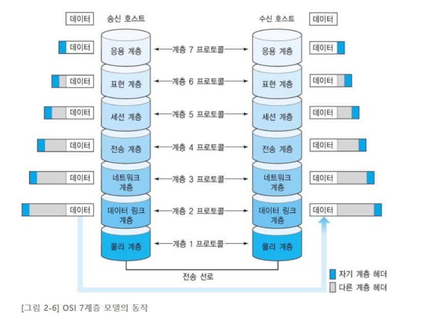

# network

## 1.네트워크 기본 규칙 및 개념

-   **네트워크** : 여러 기기가 연결되어 있는 상태

-   **인터넷** : 전 세계의 네트워크들이 연결된 거대한 네트워크

-   **랜 (LAN)** : 건물 안이나 특정 지역을 범위로 하는 근거리 네트워크

-   **왠 (WAN)** : ISP 서비스를 사용해 LAN과 LAN 사이에 구축된 광역 네트워크

-   **VPN** : 기업 내에서 여러 지점을 잇는 인트라넷을 구축할 때 네트워크를 일일히 전선으로 연결하는 것보다 비용을 절감하기 위해, 인터넷을 사용하는 대신 암호화 기술을 적용해 인트라넷처럼 통신하는 가상 사설망

-   **클라우드와 온프레미스** : 사내 또는 데이터 센터에 서버를 두고 운영하는 것을 온프레미스, 외부에 구축된 서버를 인터넷을 통해 제공받는 것을 클라우드라 함

-   **DMZ** : DeMilitarized Zone의 약자로, 인트라넷과 인터넷 사이에 위치한 네트워크 영역

-   **TCP/IP 모델** : 인터넷 표준 프로토콜

-   **OSI 7 Layer 모델 :** : ISO에서 제안한 통신 프로토콜. 응용, 표현, 세션, 전송, 네트워크, 데이터 링크, 물리 계층으로 나뉨

(OSI 7 Layer Model)\*\*이다. 두 호스트가 각각 7개 계층으로 구성된 모듈을 수행함으로써 데이터 송수신이 가능하다. 전송 데이터는 송신 호스트의 [응용 계층](https://terms.naver.com/entry.nhn?docId=2271944&ref=y)에서 시작해 하위 계층으로 순차적으로 전달되어, 최종적으로 물리 계층에서 수신 호스트에 전달된다. 수신 호스트에서는 데이터를 상위 계층으로 순차적으로 이동시켜 응용 계층에 도착하게 한다.

데이터가 하위 계층으로 이동할 때는 각 계층의 [프로토콜](https://terms.naver.com/entry.nhn?docId=2271799&ref=y)에서 정의한 헤더 정보가 추가된다. 물리 계층을 제외한 모든 계층에서 헤더 정보를 추가하고, 데이터를 수신하는 호스트에서는 반대로 상위 계층으로 이동하며 순차적으로 헤더 정보를 제거하고 해석한다.

 

---

 

### OSI (Open System Interconnection) 모델의 7개 계층구조

