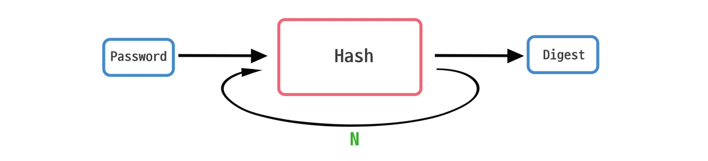
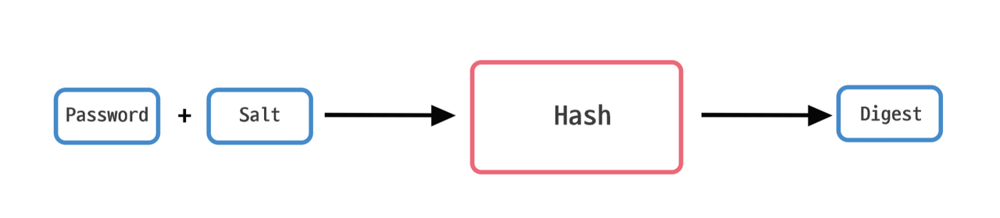
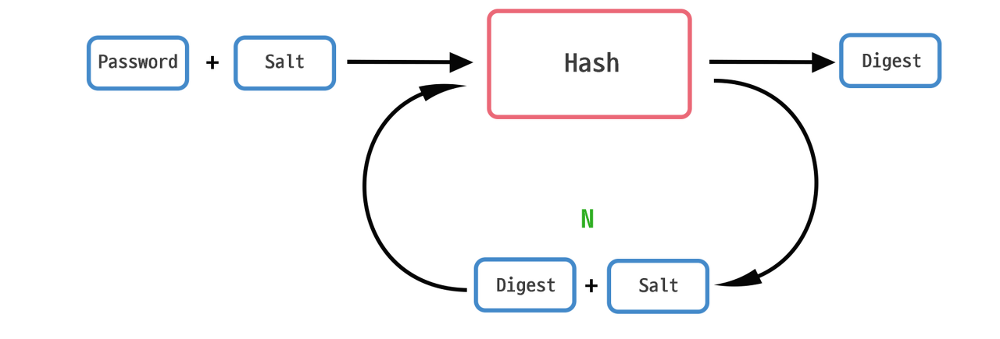

# password
[참고](https://st-lab.tistory.com/100)

해싱과 암호화는 일상에서는 어느정도 통용되지만, 암호학적으로 본다면 차이가 있다. 가장 큰 차이는 '방향성'이다. 단방향, 즉 복호화가 불가능하는 하다는 것이고 이를 '해싱'이라 부른다. 반면에 '암호화(Encryption)'는 해싱하고는 다르다. '암호화'는 '양방향'이다. 즉, 암호화를 하면 역으로 복호화도 가능한 것이다. 

 

---

 

## 단방향 해시 함수 ( One-Way Hash Function )

 

### 1. 단방향 해시 함수 ( One-Way Hash Function )란?
 

단방향 해시 함수는 어떤 수학적 연산(또는 알고리즘)에 의해 원본 데이터를 매핑시켜 완전히 다른 암호화된 데이터로 변환시키는 것을 의미한다. 이 변환을 해시라고 하고, 해시에 의해 암호화된 데이터를 다이제스트(digest)라고 한다.

단방향 해시 함수 - 다이제스트를 복호화, 즉 원본 데이터를 구할 수는 없어야 한다. 말 그대로 단방향성이다.

세계에서 가장 인기있는 비밀번호인 123456을 예로들어보자.

간단하게 그림으로 설명한다면 다음과 같다.

즉 원본 메시지 123456 을 해시 함수에 돌려서 다이제스트인 fs32a3xzz0 을 생성하고 해당 데이터를 DB 에 저장하는 것이다.

이렇게 저장된 다이제스트는 설령 DB가 털린다 하더라도 fs32a3xzz0 은 단방향으로 해싱 된 문자라 복호화 할 수가 없는 것이다. 또한 의미를 파악할 수도 없다.

이러한 단방향 해시 함수의 종류들은 매우 많다. 대표적으로 아래와 같은 알고리즘들이 있다.

SHA
MD
HAS
WHIRLPOOL
 
그중 가장 대표적인 해시 알고리즘인 SHA-256 을 통해 123456 을 해싱하면 다음과 같이 나온다.

`8d969eef6ecad3c29a3a629280e686cf0c3f5d5a86aff3ca12020c923adc6c92`

만약 조금만 변경하여 123456 다음에 마침표(.) 하나만 더 찍어도 완전히 다른 값이 나온다.

`43fae6c11d7632acc6059de1cced9b09a58caaa878071308ad67f32ef6b11691`
 

이렇게 사용자로부터 입력받은 정보를 그대로 저장하는게 아니라 해싱을 해서 저장하는 것이다.

그러면 DB를 털어 저런 값을 얻었다고 한들 기존 원래 패스워드를 유추하기 힘들게 된다.

 
 

### 2. 단방향 해시 함수의 한계점

 

1. **동일한 메시지는 동일한 다이제스트를 갖는다.**
   
   앞서 위의 123456 을 SHA-256 을 통해 다이제스트를 얻었다. 분명 123456 의 다이제스트는 원래의 password 인 123456 을 유추하기 어렵다. 그러나 123456 에 대한 다이제스트는 항상 같은 값을 얻는다는 것, 즉 값이 변하지 않는 것이 큰 문제점이다.

    그동안 해커들이 여러 값들을 대입해보면서 얻었던 다이제스트들을 모아놓은 리스트에서 찾아보는 것. 이러한 다이제스트들의 테이블을 우리는 레인보우 테이블(Rainbow Table)이라고 한다.

    구글에 'sha-256 rainbow table' 라고 검색해보면 여러 사이트가 있다.

2. **무차별 대입 공격 (브루트포스)**

    해시 함수의 경우 원래 빠른 데이터 검색을 위한 목적으로 설계된 것이다. 그렇다보니 해시 함수를 써도 원문의 다이제스트는 금방 얻어진다. 바로 이 점이 문제점인데, 우리가 다이제스트를 빠르게 얻을 수 있는 것과 동일하게 해커도 똑같이 빠르게 값을 얻을 수 있다는 것이다. 즉, 해커는 무작위의 데이터들을 계속 대입해보면서 얻은 다이제스트와 해킹할 대상의 다이제스트를 계속 비교를 해보는 것이다.

    확률적으로 매우 높은 확률로 해시충돌을 찾을 수 있다. (물론 그럼에도 찾기 힘들긴 하지만... 실제로도 SHA-1의 경우 2000년대 초에 많이 사용하던 대표적인 해시 알고리즘이었지만 SHA-1을 분석해 이론적으로 해시충돌을 찾는 복잡도를 낮췄고 2017년 실제로 해시충돌 발견에 성공했다. 그래서 많은 곳들이 SHA-2 이상의 알고리즘으로 변경되면서 사실상 거의 퇴출되었다.

 
 

### 3. 단방향 해시 함수 보완하기

1. **해시 함수 여러 번 수행하기 [키 스트레칭 _ Key Stretching]**
   
    패스워드를 저장할 때 가장 쉽게 생각 할 수 있는 방법.

    예를들어 SHA-256 을 사용한다고 가정할 때, 123456 이 입력되었다면 123456 의 다이제스트는 아래와 같았다.

    `8d969eef6ecad3c29a3a629280e686cf0c3f5d5a86aff3ca12020c923adc6c92`
 
    이 다이제스트를 한 번 더 SHA-256 에 돌리는 것이다. 그러면 아래와 같은 값이 나온다.

    `49dc52e6bf2abe5ef6e2bb5b0f1ee2d765b922ae6cc8b95d39dc06c21c848f8c`
 
    물론 돌리는 횟수는 개발자 본인만 알고있는 것이 최고지만, 설령 소스파일을 들여다보았다 하더라도 최종 다이제스트의 원문 메시지를 얻기 위해 소모되는 시간은 더욱 많이 소요되므로 해커 입장에서는 곤란해지게 된다.

    또한 해시 함수를 여러번 돌리는 만큼 최종 다이제스트를 얻는데 그만큼 시간이 소요되기 마련이다.
    
     

    

     

    사용자의 경우 패스워드를 입력하고 일치여부를 확인 할 때 0.2 ~ 0.5 초만 걸려도 크게 문제가 없다. 그러나 앞서 말했듯이 임의의 문자열을 무차별 대입하는 해커 입장에서는 1초에 10억번의 다이제스트를 얻을 수 있었으나 다이제스트를 얻기 까지의 시간을 지연시켜 이제는 한 횟수당 0.2 ~ 0.5초가 걸리기 때문에 매우 치명적이다.

    즉, 브루트포스를 최대한 무력화 하기위한 방법인 것이다.

 

2. **솔트 (Salt)**

    솔트란 해시함수를 돌리기 전에 원문에 임의의 문자열을 덧붙이는 것을 말한다. 단어 뜻 그대로 원문에 임의의 문자열을 붙인다는 의미의 소금친다(salting) 는 것이다.

     

    

    이렇게 하면 설령 다이제스트를 알아낸다 하더라도 password 를 알아내기 더욱 어려워진다. 그리고 사용자마다 다른 Salt 를 사용한다면 설령 같은 비밀번호더라도 다이제스트의 값은 다르다. 이는 결국 한 명의 패스워드가 유출되더라도 같은 비밀번호를 사용하는 다른 사용자는 비교적 안전하다는 의미기도 하다.

    예시) 사용자1과 사용자2가 123456 이라는 같은 password 를 사용하고 있다.

    하지만 사용자1은 솔트 값이 `sffs13osz043opq9dsfdkj32` 이고, 사용자2는 `osela31dif3298hcwaw8s301` 이다.

    즉 사용자1이 해시함수를 돌리기 전에 솔팅된 문자열은 `123456sffs13osz043opq9dsfdkj32` 이고, SHA-256 에 돌리면 다음과 같은 값을 얻을 수 있다.

    `343099b2867417f1b60462a8c70aa9dc33f4b1cec287fdb22e9fcf9b999ee3ce`

    사용자2의 경우 해시함수를 돌리기 전 솔팅된 문자열은 `123456osela31dif3298hcwaw8s301` 이다.

    이를 SHA-256 을 사용하여 해싱 하면 다음과 같은 값을 얻는다.

    `725c8c66c181855dd578961d90b2a051a250b232ede85a7ab5da5d0d4586d135`

    즉, 같은 패스워드를 사용하더라도 salting 된 문자열은 서로 다르기 때문에 각 사용자의 다이제스트는 서로 다른 값으로 저장될 것이다.

 

---

 

### 두 가지 혼용한 방법 예시

