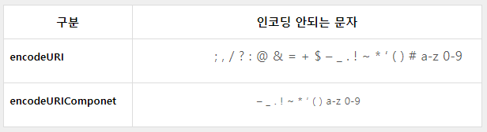
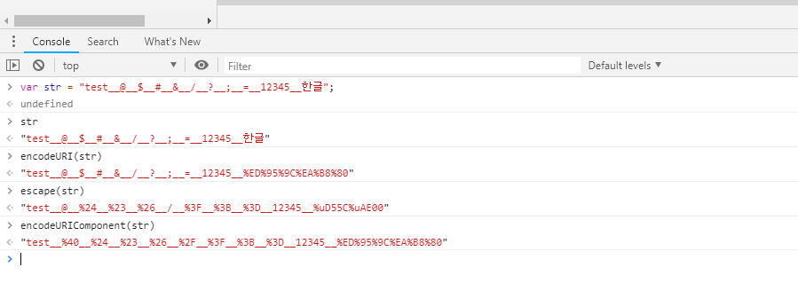

# URL 인코딩

 

## **1. URL 인코딩이란?**

URL 스펙인 RFC 1738에는 URL에 사용할 수 있는 문자는 ASCII 코드 중 알파벳, 숫자와 몇가지 특수문자로 제한되어있다.

따라서 한글 등의 다양한 문자를 URL에 표시하려면 URL에 허용하는 문자로 변환하여 표현해야 한다.

이와같이 URL에 사용할 수 없는 문자를 URL에 사용할 수 있는 7비트 ASCII 코드로 변환하는 것을 말한다.

보내려는 데이터가 영어 알파벳 'A'라고 가정해보자.

'A'의 코드 값인 0x41 (01000001)는 7비트(8비트 데이터는 무시하는) 장비를 통과하더라도 데이터를 잃지 않는다.

7비트 장비에 통과된 값은 첫번째 비트 '0'을 제외한 1000001 이지만 데이터를 8비트화 하면서 다시 맨 처음에 0값을 추가하더라도 결과적으로 01000001 이 출력되기 때문이다.

반대로, 한글의 경우 첫번째 비트 값이 '1'이 들어가기 때문에 7 비트 장비를 통과하면 앞자리 비트가 0으로 바뀌어 깨지게 된다.

'가'의 코드 값 0xAC00(10101100 00000000)은 7비트 장비를 통과하면서 첫번째 비트 '1'이 무시되고 '0'으로 사용되기 때문에 00101100 00000000 의 값이 출력되어 결국 데이터가 깨지게된다.

이와 같이 8비트 데이터를 7비트의 ASCII 코드로 변환하는 기술을 퍼센트 인코딩이라고 하는데 일반적으로 URL에 들어가는 정보를 인코딩하는데 많이 사용되어 URL 인코딩이라고 불린다.

 

---

 

## **2. URL 인코딩 방법**

기존 문자열의 HEX 값 앞에 %를 붙여서 문자열이 인코딩 되었음을 알린다.

'가'를 인코딩 하는 경우 HEX 코드 값(0xAC00)을 그대로 ASCII 코드로 문자화하면 '%AC%00' 이된다.

ASCII 코드 중 URL에 사용할 수 없는 예약된 문자는 아래와 같다. 즉, 반드시 인코딩을 해야 한다.

즉, 문자열 중 '%'가 포함되어 있다면 '%'의 HEX 코드 값(0x25)을 문자화하여 '%25'로 인코딩해야 한다.

! - ' % ; : @ &

 

---

 

## **3. 웹에서 전달되는 인코딩 종류**

웹 페이지는 특성한 클라이언트 페이지에서 서버로 전달하는 구조를 가지고있다. 그게 아작스건 일반 웹폼이던 뭐든  기본구조이다. 그래서 인코딩은 크게 클라이언트 인코딩 / 서버인코딩으로 나눌 수 있다.  이미 알고있는 이야기이지만, 클라이언트 단은 javascript  , 서버단은 asp , asp net ,jsp , php 기타 등의 서버 페이지들 이다. 클라이언트에서 전달된 text 정보들이 서버단으로 넘어가면서 서로 다른 인코딩 페이지로 구성되어 있다면 깨지기 마련이다. 그래서 항상 그렇게 이야기를  많이한다. "Url 인코딩" 또는 "인코딩" 해너 넘겨주세요.

 

---

 

## **4. javascript 에서의 3가지 인코딩 함수**

(아래설명에 있지만 escape는 더 이상  사용하지 않는 함수로 구분되어있다.)

- **escape (≠unescape)**
- **encodeURI(≠decodeURI)**
- **encodeURIComponent(≠decodeURIComponent)**

 

### 4.1 크롬 개발자 도구(F12)로 테스트

원본 문자 : test**@**$**#**&**/**?**;**=**12345**한글

escape :

encodeURI :

encodeURIComponent :

