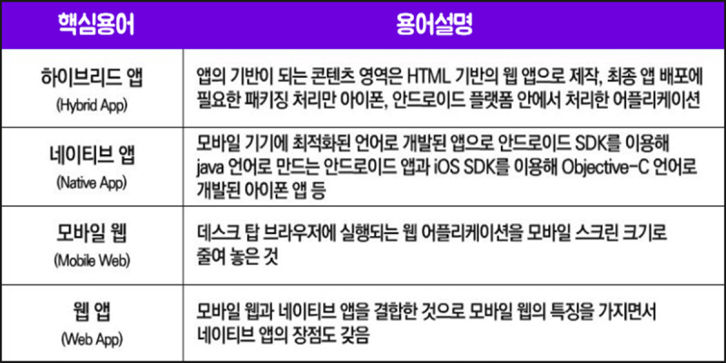

# web app

## 네이티브 앱 (Native App)

    어플리케이션

모바일 기기에 최적화된 언어로 개발된 앱으로 안드로이드 SDK를 이용한 Java 언어나 iOS 기반 SDK를 이용한 Swift 언어로 만드는 앱이 네이티브 앱에 속한다.

### 장점

- 성능이 웹앱, 하이브리드 앱에 비해 가장 높음
- 네이티브 API를 호출하여 사용함으로 플랫폼과 밀착되어있음
- Java나 Swift에 익숙한 사용자면 쉽게 접근 가능함

### 단점

- 플랫폼에 한정적
- 언어에 제약적

 

## 모바일 웹 앱 (Mobile Wep App)

모바일웹 + 네이티브 앱을 결합한 형태

모바일 웹의 특징을 가지면서도, 네이티브 앱의 장점을 지녔다. 따라서 기존의 모바일 웹보다는 모바일에 최적화 된 앱이라고 말할 수 있다.

웹앱은 SPA를 활용해 속도가 빠르다는 장점이 있다.

쉽게 말해, PC용 홈페이지를 모바일 스크린 크기에 맞춰 줄여 놓은 것이라고 생각하면 편함

### 장점

- 웹 사이트를 보는 것이므로 따로 설치할 필요X
- 모든 기기와 브라우저에서 접근 가능
- 별도 설치 및 승인 과정이 필요치 않아 유지보수에 용이

### 단점

- 플랫폼 API 사용 불가능. 오로지 브라우저 API만 사용가능
- 친화적 터치 앱을 개발하기 약간 번거로움
- 네이티브, 하이브리드 앱보다 실행 까다로움 (브라우저 열거 검색해서 들어가야함)

 

## 하이브리드 앱 (Hybrid App)

네이티브 웹에, 웹 view를 띄워 웹앱을 실행시킨다. 양쪽의 API를 모두 사용할 수 있는 것이 가장 큰 장점

### 장점

- 네이티브 API, 브라우저 API를 모두 활용한 다양한 개발 가능
- 웹 개발 기술로 앱 개발 가능
- 한번의 개발로 다수 플랫폼에서 사용 가능

### 단점

- 네이티브 기능 접근 위해 개발 지식 필요
- UI 프레임도구 사용안하면 개발자가 직접 UI 제작

 

---

 

## 요약

