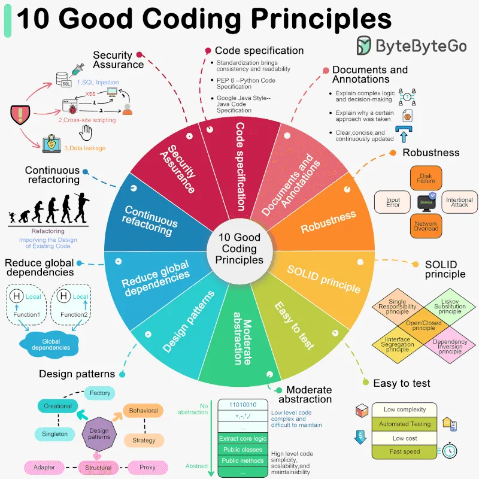

# Code Quality

[참고링크](https://blog.bytebytego.com/p/ep97-10-good-coding-principles-to)

 

1. 코드 사양 따르기(Follow Code Specifications)

    코드를 작성할 때 "PEP 8", "Google Java Style"과 같이 업계에서 잘 확립된 표준을 따르는 것이 중요하며, 합의된 코드 사양을 준수하면 코드 품질이 보장됩니다. 일관되고 읽기 쉽습니다.

2. 문서화 및 주석 (Documentation and Comments)

    좋은 코드는 복잡한 논리와 결정을 설명하기 위해 명확하게 문서화되고 주석 처리되어야 하며, 주석은 정확히 수행되는 작업(“무엇”)보다는 특정 접근 방식을 취한 이유(“왜”)를 설명해야 합니다. 문서와 의견은 명확하고 간결하며 지속적으로 업데이트되어야 합니다.

3. 견고성 (Robustness)

    좋은 코드는 충돌이나 예측할 수 없는 결과를 생성하지 않고 예상치 못한 다양한 상황과 입력을 처리할 수 있어야 합니다. 가장 일반적인 접근 방식은 예외를 포착하고 처리하는 것입니다.

4. SOLID 원칙(Follow the SOLID principle)

    “단일 책임”, “개방/폐쇄”, “리스코프 대체”, “인터페이스 분리”, “의존성 역전”을 따릅니다. 이 5가지 원칙(줄여서 SOLID)은 확장 가능하고 확장 가능한 코드 작성의 초석입니다. 유지 관리가 쉽습니다.

5. 테스트를 쉽게 하세요(Make Testing Easy)

    소프트웨어의 테스트 가능성은 특히 중요합니다. 좋은 코드는 각 구성 요소의 복잡성을 줄이고 예상대로 작동하는지 확인하기 위한 자동화된 테스트를 지원함으로써 테스트하기 쉬워야 합니다.

6. 추상화(Abstraction)

    추상화를 위해서는 핵심 로직을 추출하고 복잡성을 숨겨 코드를 더욱 유연하고 일반적으로 만들어야 합니다. 좋은 코드는 과도하게 설계되거나 장기적인 확장성과 유지 관리성을 무시하지 않고 적당한 수준의 추상화를 가져야 합니다.

7. 디자인 패턴을 활용하되 지나치게 디자인하지 마세요(Utilize Design Patterns, but don't over-design)

    디자인 패턴은 몇 가지 일반적인 문제를 해결하는 데 도움이 됩니다. 그러나 모든 패턴에는 적용 가능한 시나리오가 있습니다. 디자인 패턴을 과도하게 사용하거나 오용하면 코드가 더 복잡해지고 이해하기 어려워질 수 있습니다.

8. 글로벌 종속성 줄이기(Reduce Global Dependencies)

    글로벌 변수와 인스턴스를 사용하면 종속성에 빠져 상태 관리가 혼란스러워질 수 있습니다. 좋은 코드는 현지화된 상태와 매개변수 전달에 의존해야 합니다. 함수에는 부작용이 없어야 합니다.

9. 지속적인 리팩토링(Continuous Refactoring)

    좋은 코드는 유지 관리 및 확장이 가능합니다. 지속적인 리팩토링은 가능한 한 빨리 문제를 식별하고 수정하여 기술 부채를 줄입니다.

10. 보안이 최우선입니다(Security is a Top Priority)

    좋은 코드는 일반적인 보안 취약성을 방지해야 합니다.
