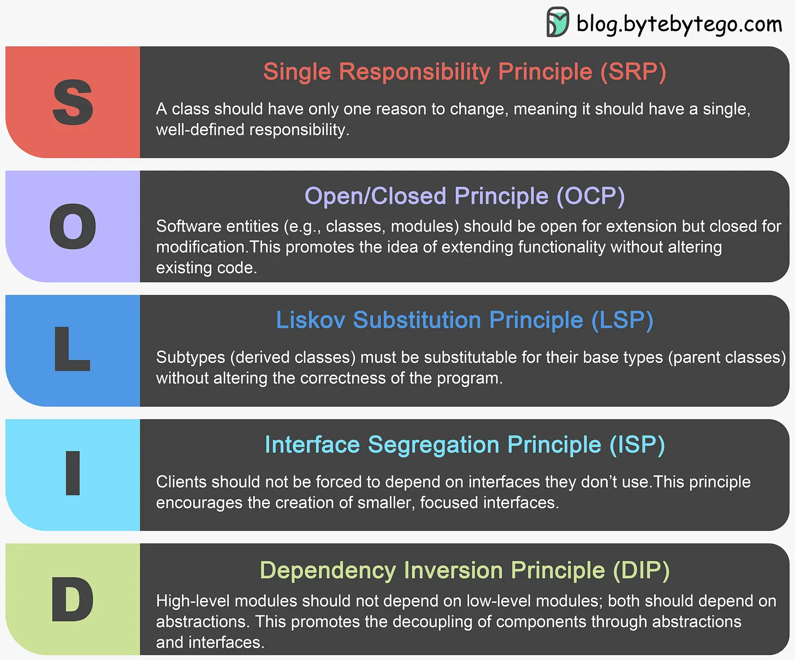

# 디자인 원리

SOLID 원칙은 소프트웨어 개발자가 유지 관리 가능하고 확장 가능하며 유연한 소프트웨어 시스템을 만들 수 있도록 안내하기 위해 Robert C. Martin이 도입한 5가지 기본 설계 원칙 세트입니다. 이러한 원칙을 따르면 시간이 지남에 따라 더 쉽게 이해하고 수정하고 확장할 수 있는 소프트웨어 개발에 기여할 수 있습니다.

- 유지 관리성: Maintainability:건전한 디자인 원칙을 따르면 코드의 유지 관리가 더욱 쉬워집니다. 코드가 잘 구조화되어 있고 이러한 원칙을 준수하면 문제를 식별 및 수정하고, 새로운 기능을 추가하고, 의도하지 않은 결과를 초래하지 않고 개선하는 것이 더 쉬워집니다.

- 확장성: Scalability:잘 설계된 소프트웨어는 확장 가능합니다. 광범위한 재작업을 요구하거나 점점 더 복잡해지지 않고도 요구사항의 변화와 증가를 수용할 수 있습니다.

- 코드 재사용성: Code Reusability:설계 원칙을 준수하면 재사용성이 더 높은 코드를 얻을 수 있는 경우가 많습니다. 재사용 가능한 구성 요소는 개발 및 테스트에 소요되는 시간과 노력을 절약해 줍니다.

- 협업: Collaboration:디자인 원칙은 개발자가 작업할 수 있는 공통 프레임워크를 제공합니다. 이러한 공통된 이해는 협업을 촉진하고 팀원 간의 오해를 줄여줍니다.

- 버그 및 함정 감소: Reduced Bugs and Pitfalls:설계 원칙을 따르면 일반적인 프로그래밍 함정과 설계 결함을 식별하고 완화하는 데 도움이 됩니다. 결과적으로 버그가 줄어들고 소프트웨어가 더욱 강력해집니다.

- 미래 보장: Future-Proofing: 잘 설계된 소프트웨어는 변화하는 요구 사항과 기술에 적응할 수 있습니다. 이는 소프트웨어 제품의 장기적인 생존 가능성에 대한 투자입니다.
