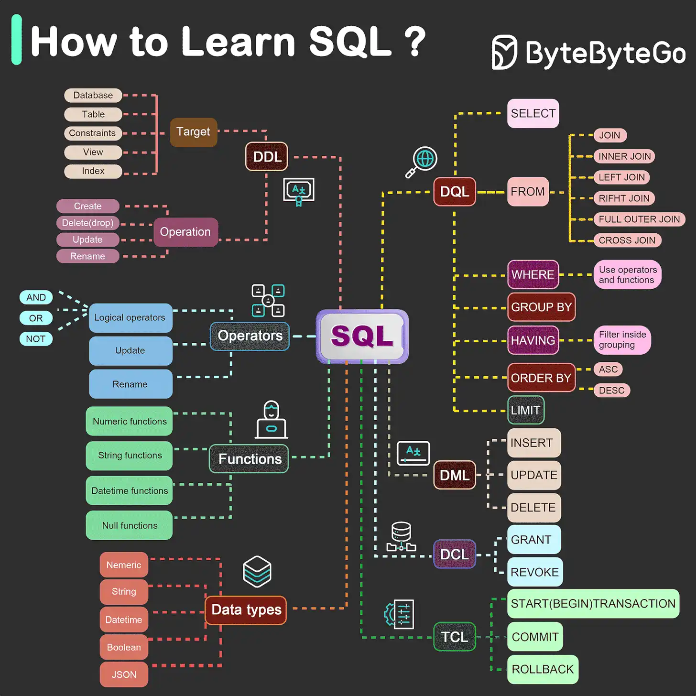

# SQL basic

### 5가지 구성 요소

- DDL: CREATE, ALTER, DROP 등의 데이터 정의 언어

- DQL: SELECT와 같은 데이터 쿼리 언어

- DML: INSERT, UPDATE, DELETE 등의 데이터 조작 언어

- DCL: GRANT, REVOKE 등의 데이터 제어 언어

- TCL: COMMIT, ROLLBACK과 같은 트랜잭션 제어 언어
