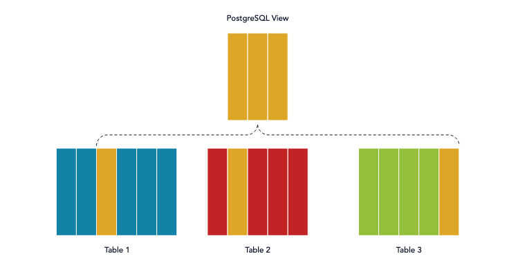

# 뷰 테이블

가상 테이블. 실제 데이터가 저장되는 것이 아닌, 뷰를 통해 데이터를 관리하는 것. TABLE은 실질적인 데이터가 있지만 VIEW는 데이터가 없고 SQL만 저장한다.



```sql
CREATE 생략가능[OR REPLACE] 생략가능[FORCE | NOFORCE] VIEW 뷰명
AS (SELECT문)
생략가능[WITH CHECK OPTION 생략가능[CONSTRAINT 제약조건명]]
생략가능[WITH READ ONLY 생략가능[CONSTRAINT 제약조건명]]
```

- OR REPLACE option : 해당 구문 사용하면 뷰를 수정할 때 DROP 없이 수정 가능

- With Check option : 주어진 제약 조건에 맞는 데이터만 입력 및 수정 가능

- With read only : select 만 가능

```sql
--학교 테이블에서 학년이 3인 학생들의 성명과 학번을 학교뷰테이블이라는 뷰로 만드는 쿼리
CREATE OR REPLACE VIEW 학교뷰테이블(성명, 학번)
AS SELECT 성명, 학번
FROM 학교
WHERE 학년 ='3';
```

<br/>

## 사용하는 이유

- 한개의 뷰로 여러 테이블에 대한 데이터를 검색할 수 있다.

- 뷰를 통해서만 데이터에 접근하게 되면 뷰에 없는 데이터를 안전하게 보호할 수 있다.

- 조인 쿼리문을 매번 작성하기 보다는 조회 쿼리문을 뷰로 만들어놓고 뷰를 조회하는 것이 편하기 때문에 VIEW를 사용

기본 조회 쿼리

```sql
select
stu.name,
d.deptno
from student stu, department d, professor p
where student deptno = d.deptno
and d.pno = p.id
```

VIEW 생성해서 조회하는 쿼리

```sql
CREATE OR REPLACE VIEW v1
AS
select
stu.name,
d.deptno
from student stu, department d, professor p
where student deptno = d.deptno
and d.pno = p.id;
```

<br/><br/>

## 장점

- 유연성: 다양한 데이터를 기반으로 ‘필요한 정보를 동적으로 생성’할 수 있습니다.
- 효율성: 기존 테이블에서 데이터를 조합하거나 필터링하여 ‘필요한 정보에 빠르게 접근’할 수 있습니다.
- 보안: ‘기존 테이블에 대한 접근 권한’을 제한할 수 있어 데이터 보안을 강화할 수 있습니다.
- 간결성: 사용하면 ‘복잡한 쿼리를 단순화’할 수 있으며 ‘중복된 코드를 줄여서 유지보수를 용이’하게 할 수 있습니다.
- 가독성: 사용하면 데이터 모델을 더 ‘직관적이고 읽기 쉽게’ 만들 수 있습니다.
- 재사용성: 다른 쿼리나 뷰에서 ‘재사용’할 수 있어 개발 생산성을 향상시킵니다.
- 표준화: ‘데이터 모델의 일관성과 표준화’를 유지할 수 있도록 도와줍니다.
- 성능 최적화: ‘복잡한 연산을 최적화’하여 데이터 접근과 처리 속도를 향상시킬 수 있습니다.
- 유지보수성: 사용하면 데이터 모델이 변경되더라도 응용 프로그램을 수정할 필요 없이 기존 뷰를 업데이트할 수 있어 유지보수가 용이합니다.
- 통합성: 사용하면 여러 테이블에서 필요한 정보를 한 곳에 ‘통합하여 관리’할 수 있습니다.

<br/>

## 단점

- 성능 저하: 실제 데이터를 기반으로 ‘동적으로 생성’되기 때문에 쿼리 실행 시 ‘추가적인 계산이 필요’하며, 이로 인해 성능이 저하될 수 있습니다.
- 업데이트 제약: 기존 테이블의 데이터를 참조하기 때문에 기존 테이블의 구조나 데이터 변경 시 뷰 테이블을 업데이트하는 작업이 필요합니다.
- 데이터 일관성: 기존 테이블의 데이터를 참조하므로, 기존 테이블의 데이터가 변경되면 뷰 테이블과의 일관성을 유지하기 위해 추가 작업이 필요합니다.
- 제약 조건: 기본 테이블의 제약 조건을 상속하지 않기 때문에 별도로 제약 조건을 정의해야 합니다.
- 업데이트 제한: 일부 뷰 테이블은 특정 조건을 만족하지 않는 데이터를 수정할 수 없습니다.

<br/>

## 고려할 사항

1. 뷰 테이블을 생성할 때에는 기본 테이블의 데이터를 조회하여 ‘새로운 가상 테이블을 생성하는 작업’이 수행됩니다.

   - 이 작업은 시간과 리소스를 소모할 수 있으며, 뷰 테이블에 대한 쿼리가 실행될 때마다 해당 작업이 반복됩니다.
   - 따라서 뷰 테이블을 자주 사용하거나 대용량의 데이터를 처리해야 할 경우, 뷰 테이블 생성 및 조회 작업에 대한 성능 저하가 발생할 수 있습니다.

2. 뷰 테이블은 기본 테이블과 조인하여 데이터를 가져오는 작업이 필요한 경우가 많습니다. 이 경우, 뷰 테이블과 기본 테이블 사이의 조인 작업이 수행되어야 합니다.

   - 조인 작업은 데이터베이스의 성능에 영향을 줄 수 있는 복잡한 작업 중 하나입니다.
   - 따라서 조인 작업을 최적화하고 인덱스를 적절하게 사용하여 성능을 향상하는 것이 중요합니다. 잘못된 조인 작업이나 부적절한 인덱스 사용은 성능 저하를 초래할 수 있습니다.

3. 뷰 테이블은 기본 테이블의 데이터가 변경되면 그에 따라 업데이트되어야 합니다.

   - 뷰 테이블을 사용하는 경우, 기본 테이블의 데이터 변경에 따라 뷰 테이블도 업데이트되어야 합니다. 이는 성능상의 부담을 초래할 수 있으며, 데이터의 일관성을 유지하기 위해 추가적인 작업이 필요합니다.
