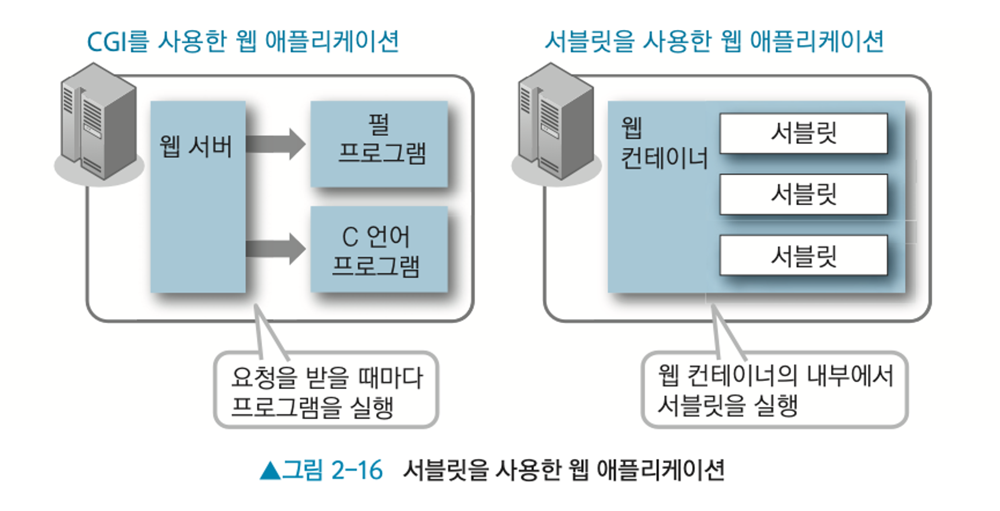

# Servlet

    클라이언트의 요청을 처리하고, 그 결과를 반환하는 Java 의 동적 웹 프로그래밍 기술이다.

기본적으로 Servlet 은 CGI 와 기술 체계가 매우 유사하다. CGI 가 기존 요청에 대해 프로그램을 실행하는 방식이라면, Servlet 는 요청별로 새로운 Servlet 을 실행하는 방식이다. 단, Servlet 은 컨테이너를 통해 개별적으로 Servlet 의 생명주기를 관리한다는 점이 다르다.

## 특징

Servlet 은 다음과 같은 3가지 메서드를 가지고 있다.

- init() : Servlet 인스턴스를 생성한다.
- service() : Servlet 의 기능을 수행하는 메서드로, HTTP Method 에 따라, doGet(), doPost(), doPut(), doDelete() 등의 메서드들이 호출된다. 개발자는 해당 요청을 알맞게 연결한 후, doXXX() 메서드를 오버라이드하여, 응답할 컨텐츠를 구현해야 한다.
- destroy() : Servlet 인스턴스를 종료한다.

실질적으로 개발자는 xml 파일에, 구현한 인스턴스를 등록하여 언어에게 이를 알리고, Servlet 별로, 요청에 따른 응답을 구현하면, 요청 시 서버에서 이를 알아서 호출하여 적절한 동적 컨텐츠가 반환되도록 하는 것이다.

추후 등록과정은 @WebServlet 어노테이션을 사용하는 것으로 web.xml 에 설정이 더욱 간소화된다.

