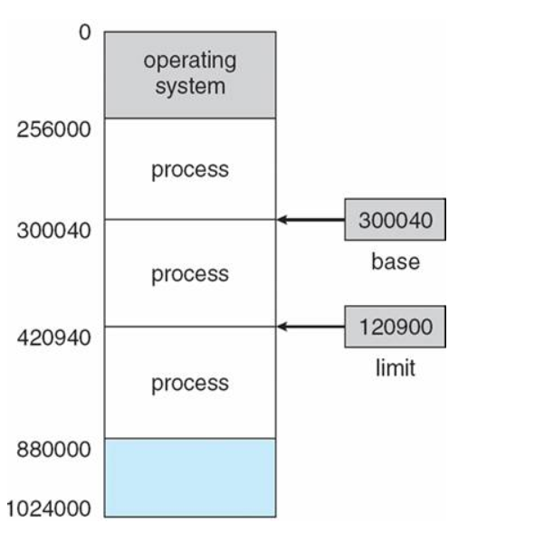

# Memory

 

## 메인 메모리(main memory)

    CPU가 직접 접근할 수 있는 기억 장치

    프로세스가 실행되려면 프로그램이 메모리에 올라와야 함

주소가 할당된 일련의 바이트들로 구성되어 있음

CPU는 레지스터가 지시하는대로 메모리에 접근하여 다음에 수행할 명령어를 가져옴

명령어 수행 시 메모리에 필요한 데이터가 없으면 해당 데이터를 우선 가져와야 함

이 역할을 하는 것이 바로 MMU.

 

## MMU (Memory Management Unit, 메모리 관리 장치)

    논리 주소를 물리 주소로 변환해 준다.

    메모리 보호나 캐시 관리 등 CPU가 메모리에 접근하는 것을 총 관리해 주는 하드웨어임

메모리의 공간이 한정적이기 때문에, 사용자에게 더 많은 메모리를 제공하기 위해 '가상 주소'라는 개념이 등장 (가상 주소는 프로그램 상에서 사용자가 보는 주소 공간이라고 보면 됨)

이 가상 주소에서 실제 데이터가 담겨 있는 곳에 접근하기 위해선 빠른 주소 변환이 필요한데, 이를 MMU가 도와주는 것

 

### 역할

MMU가 지원되지 않으면, physical address를 직접 접근해야 하기 때문에 부담이 있다.

MMU는 사용자가 기억장소를 일일이 할당해야 하는 불편을 없애준다.

프로세스의 크기가 실제 메모리의 용량을 초과해도 실행될 수 있게 해준다.

또한 메인 메모리의 직접 접근은 비효율적이므로, CPU와 메인 메모리 속도를 맞추기 위해 캐시가 존재함

 

### MMU의 메모리 보호

프로세스는 독립적인 메모리 공간을 가져야 되고, 자신의 공간만 접근해야 함

따라서 한 프로세스에게 합법적인 주소 영역을 설정하고, 잘못된 접근이 오면 trap을 발생시키며 보호함

base와 limit 레지스터를 활용한 메모리 보호 기법

base 레지스터는 메모리상의 프로세스 시작주소를 물리 주소로 저장 limit 레지스터는 프로세스의 사이즈를 저장

이로써 프로세스의 접근 가능한 합법적인 메모리 영역(x)은

> base <= x < base+limit

이 영역 밖에서 접근을 요구하면 trap을 발생시키는 것

안전성을 위해 base와 limit 레지스터는 커널 모드에서만 수정 가능하도록 설계 (사용자 모드에서는 직접 변경할 수 없도록)

