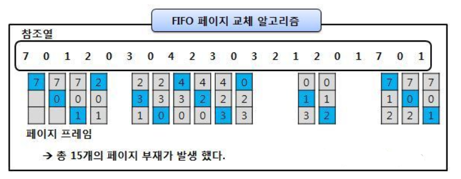
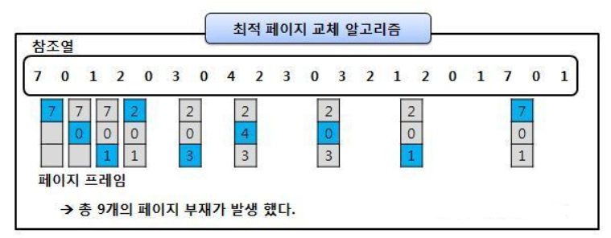
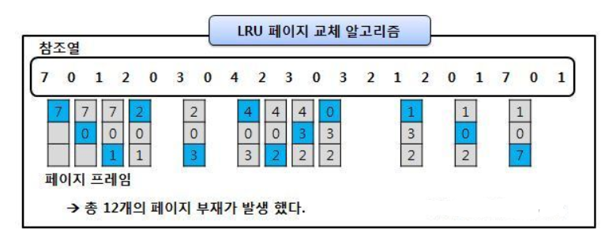

# page replacement(페이지 교체 알고리즘)

> 페이지 부재 발생 → 새로운 페이지를 할당해야 함 → 현재 할당된 페이지 중 어떤 것 교체할 지 결정하는 방법

메모리가 가득 차면, 추가로 페이지를 가져오기 위해서 안쓰는 페이지는 out하고, 해당 공간에 현재 필요한 페이지를 in 시켜야 함

여기서 어떤 페이지를 out 시켜야할 지 정해야 함. (이때 out 되는 페이지를 victim page라고 부름)

- Page Reference String

  > CPU는 논리 주소를 통해 특정 주소를 요구함
  >
  > 메인 메모리에 올라와 있는 주소들은 페이지의 단위로 가져오기 때문에 페이지 번호가 연속되어 나타나게 되면 페이지 결함 발생 X
  >
  > 따라서 CPU의 주소 요구에 따라 페이지 결함이 일어나지 않는 부분은 생략하여 표시하는 방법이 바로 Page Reference String

 

## 1. FIFO 알고리즘

> First-in First-out, 메모리에 먼저 올라온 페이지를 먼저 내보내는 알고리즘

victim page : out 되는 페이지는, 가장 먼저 메모리에 올라온 페이지

 

## 2. OPT 알고리즘

> Optimal Page Replacement 알고리즘, 앞으로 가장 사용하지 않을 페이지를 가장 우선적으로 내보냄

 

## 3. LRU 알고리즘

> Least-Recently-Used, 최근에 사용하지 않은 페이지를 가장 먼저 내려보내는 알고리즘

최근에 사용하지 않았으면, 나중에도 사용되지 않을 것이라는 아이디어에서 나옴

OPT의 경우 미래 예측이지만, LRU의 경우는 과거를 보고 판단하므로 실질적으로 사용이 가능한 알고리즘

(실제로도 최근에 사용하지 않은 페이지는 앞으로도 사용하지 않을 확률이 높다)

OPT보다는 페이지 결함이 더 일어날 수 있지만, 실제로 사용할 수 있는 페이지 교체 알고리즘에서는 가장 좋은 방법 중 하나임

 

## 교체 방식

- Global 교체

  메모리 상의 모든 프로세스 페이지에 대해 교체하는 방식

- Local 교체

  메모리 상의 자기 프로세스 페이지에서만 교체하는 방식

다중 프로그래밍의 경우, 메인 메모리에 다양한 프로세스가 동시에 올라올 수 있음

따라서, 다양한 프로세스의 페이지가 메모리에 존재함

페이지 교체 시, 다양한 페이지 교체 알고리즘을 활용해 victim page를 선정하는데, 선정 기준을 Global로 하느냐, Local로 하느냐에 대한 차이

→ 실제로는 전체를 기준으로 페이지를 교체하는 것이 더 효율적이라고 함. 자기 프로세스 페이지에서만 교체를 하면, 교체를 해야할 때 각각 모두 교체를 진행해야 하므로 비효율적
