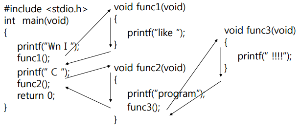

# 프로세스의 주소 공간

프로그램이 CPU에 의해 실행됨 → 프로세스가 생성되고 메모리에 '프로세스 주소 공간'이 할당됨

프로세스 주소 공간에는 코드, 데이터, 스택으로 이루어져 있다.

- 코드 Segment : 프로그램 소스 코드 저장
- 데이터 Segment : 전역 변수 저장
- 스택 Segment : 함수, 지역 변수 저장

 

- 이유: 최대한 데이터를 공유하여 메모리 사용량을 줄여야 하기 때문.

> 프로그램의 함수와 지역 변수는, LIFO(가장 나중에 들어간게 먼저 나옴)특성을 가진 스택에서 실행된다. 
> 따라서 이 함수들 안에서 공통으로 사용하는 '전역 변수'는 따로 지정해주면 메모리를 아낄 수 있다.