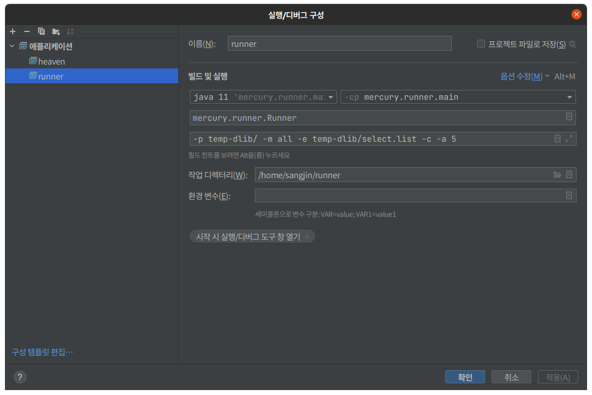
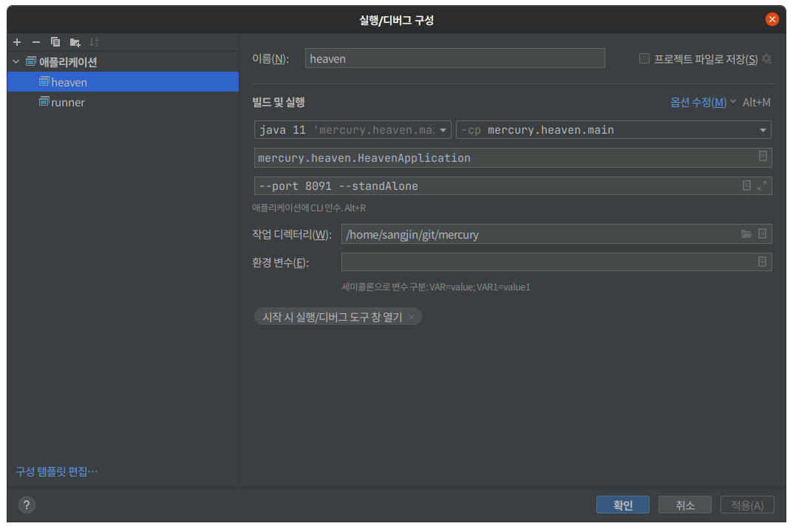

# build<br/><br/>

<br/>

## git

1. newschema로 다 바꿈

```bash
git checkout feature/newschema

git clone ssh://git@10.0.0.101:26330/coyoteBuilder
git checkout new_schema
```

2. coyotebuilder의 whiteList.json 파일 수정

- 라이센스 발급을 위한 버전관리

```json
serverMac: any,
serverDate: inf,
version: 0.0.0,
whiteList ["any@inf"]
```

3. coyotebuilder의 engineBuild 파일에 필요한 파일들을 넣어줌

   - 18, 20 폴더가 있는데 각각 넣어주면 됨

     - clang 폴더를 만들어서 alex > temp > jongwoo > srcinfo(plugin)의 clang, SrcInfo.so를 각각 버전에 맞게 넣어주고 이름에서 버전은 지워준다.

     ```bash
     sudo cp -rf clang clang++ SrcInfo.so ~/git/coyoteBuilder/engineBuild/20.04/clang/

     ```

     - developer > Coyote > CoyoteBuilderSubFile에서 나머지 파일을 복사해서 넣어준다. (변하지 않기때문)

     ```bash
     cd git/coyoteBuilder
     node dist/Build.js
     ```

   - engine version check

   ```bash
      dotnet highlander.dll
   ```

4. java와 및 환경을 설정해준다.

   - [도커빌드용 참고](https://www.notion.so/codemind/Docker-3254f657c56d435d9fcbcff2a45a3d0d)

-mb mercury branch
-cb coyote branch

su postgres
psql
ps aux | grep runner

<br/><br/>

---

<br/><br/>

## psql

ssh 서버에서 아래의 명령어를 입력하면 postgreSQL로 접근가능하다.

```bash
su postgres
psql
```

psql 도움말 - `\?`

sql 도움말 - `\h`

특정 sql 쿼리에 대한 도움말 - `\h select`

database 전체 목록 확인 - `\l`

테이블 목록 확인 - `\d or \dt`
테이블 상세 정보 확인 - `\d+`

schema 확인 - `\ds`

다른 database 사용하기 - `\c Database 이름`

psql 종료 - `\q`

<br/><br/>

---

<br/><br/>

## jenkins build

1. Main 브런치에서 Jenkinsfile, Jenkinsfile_nightly를 가지고 옴

   - Main 브런치에 해당파일 push필요

2. 나머지 runner와 관련된 수정 파일은 newSchema에서 작업

   - push가 필요하진 않음
   - gradle clean jar로 빌드 파일 생성 필요

   ```bash
   # 1 빌드파일 생성
   gradle clean jar

   # 2 빌드파일을 각 jenkins server에 이동
   scp -P19999 build/libs/runner-2.2.0.jar   jenkins@10.0.0.5:/var/lib/jenkins/runnerTest/runner.jar

   scp -P19999 build/libs/runner-2.2.0.jar   jenkins@10.0.0.5:/var/lib/jenkins/runnerTestLight/runner.jar

   scp -P19999 build/libs/runner-2.2.0.jar   jenkins@10.0.0.5:/var/lib/jenkins/runnerTestRelease/runner.jar
   ```

<br/><br/>

---

<br/><br/>

## jenkins에서 다른 버전으로 빌드

```bash
# standalone
node /var/lib/jenkins/coyoteBuilder/dist/Build.js -bt st -vs 4.3.1 -mb 4.3.3 -cb Main -li 20.04 -y -cy /var/lib/jenkins/Coyote/ -mc /var/lib/jenkins/mercury/

# engine
node /var/lib/jenkins/coyoteBuilder/dist/Build.js -bt en -vs 4.3.1 -mb 4.3.3^Ccb Main -li 20.04 -y -cy /var/lib/jenkins/Coyote/ -mc /var/lib/jenkins/mercury/
```

product가 생성이 된다
빌드하려는 해당 폴더로 product 이동

```bash
# 빌드된 프로덕트 버전 확인
cd product
dotnet magic.dll
# 첫 줄
```

> 여기의 defaultInstance를 가지고 mercury_bin.json파일을 만듦.  
> 이 파일이 어떤 위치의 엔진을 바라보게 하는지 루트가 저장돼있음  
> runner > src > main > scala > mercury.runner > dto > MercuryBinary.scala

<br/><br/>

---

<br/><br/>

## 최신버전으로 빌드하기

1. mercury와 coyote, coyoteBuilder 브랜치를 Main, master로 바꿔주기 (git pull 필요)
2. git/coyoteBuilder/engineBuild/20.04/clang 에 alex의 SrcInfo와 clang을 복사해줌
3. coyoteBuilder 폴더에서 node dist/Build.js -> engine 선택
   - dotnet error가 나오면 mercury 폴더에서 dotnet restore 해주면 웬만하면 해결
   - make 오류면 mercury/gaga/api 에서 make를 해주면 웬만하면 해결

엔진 파일인 product를 최신 빌드가 필요한 각 폴더에 넣어줌(갈아끼우기)

```
engine -> product

standAlone -> /opt/COYOTE/.coyote/
server -> /coyote/
runner -> /runner/
```

3. clang과 llvm의 버전도 맞춰주기
   /usr/bin/llc 를 기본적으로 사용하는데, 여기서 llvm 최신을 불러준다

```bash
sudo rm -rf /usr/bin/llc #기존의 llc 삭제
sudo ln -s /usr/bin/llc-12 /usr/bin/llc #llvm 최신 설정
llc --version #확인
```

<br/><br/>

---

<br/><br/>

## otp version

1. coyoteBuilder pull
2. coyoteBuilder - code -n .
3. whiteList.json

```js
{
  "serverMac": "any",
  "serverDate": "inf",
  "version": "0.0.0",
  "whiteList": ["any@inf"],
  "comId": "12345678(8자리 키)",
  "parallel": 4
}
```

4. node dist/Build.js -bt wl
5. sudo -cp -f coyote.lic /opt/COYOTE/freddie/
6. cd mercury/otp
7. gradle clean jar && cd /git/mercury/otp/build/libs
8. java -jar otp-2.2.jar -g 12345678(8자리 키)
9. 나온 숫자를 코요테 실행할때 삽입 - 이후엔 따로 체크하지 않음

<br/><br/>

---

<br/><br/>

## dfs version(이제 사용안함)

mercury, coyote - new_commandOption branch
Ctrl + F2 로 dfs 항목 노출 가능

<br/><br/>

---

<br/><br/>

## intelliJ debugging

<br/><br/>

- runner debugging 환경 세팅 예시
  

<br/><br/>

- heaven debugging 환경 세팅 예시
  

<br/><br/>

---

<br/><br/>

## server client version build

```bash
#env.js의 standAlone을 false로 수정
cd git/coyoteBuilder/
node dist/Build.js # server로 build

sudo dpkg -i pkg-coyote-essential.deb

# account user를 등록한다.
cd /coyote/
sudo ./add-coyote-account.sh sangjin

cd .coyote/
nano run-coyote-daemon.sh # PORT와 NAME의 포트번호를 intelliJ의 빌드포트번호와 동일하게 수정

cd git/mercury/
#intelliJ를 빌드하면 해당 폴더로 .token 파일이 생기고 .coyote 폴더로 이동
cp -f .token ~/.coyote/
```
