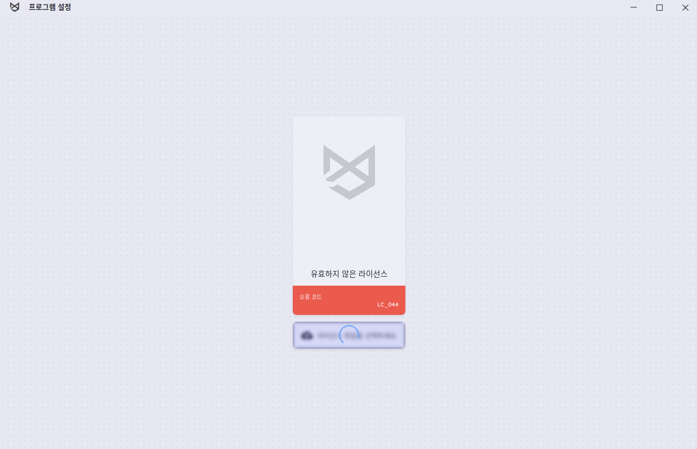

# coyote

<br/>

## todo

- files.json의 옵션들을 설정할 수 있도록
  do-manual.sh, [strategy: "cfg"] - 주로 이거
- files.json 옵션 추가 - clangExtraOption 참고 -s 옵션 참고
  magicExtraOption
  miracleExtraOption
  highlanderExtraOption

- selenium coyote에 적용해보기

## clear

- - margin
- input-text와 input-list 앞 라인이 안맞음
- input-text title과 inputbox line이 안맞음

* draggableList2 지우기
* snapshotSetting, allSnapshotSetting도 수정
* 크기가 자동으로 조절이 안됨
* 삭제 크기 조정, 아이콘 위치 가운데로 못하나..?

* tclimit(테스트 케이스 생성 최대 개수 ) => tcLimit 서버 수정
* 저장 안되는 문제
* focus 명암
* 테스트 케이스 생성 최대 개수 컬럼 쏠림 현상

## setup

2가지 버전에 대한 빌드 세팅

> standAlone --standAlone  
> serverClient --safe-token

> env.js 에서 isStandAlone의 값을 바꿔줌

- sc version은 freddie 파일과 토큰이 필요함

sc version

- .token을 생성
- .token을 freddie 폴더에 이동
- properties파일에 engine 위치 있음
  - product 파일이 있어야함(해당위치에)
- userAuth가 다름 (.token에 있는걸로)

```bash
cd ~
# cp -rf /opt/COYOTE/freddie/ .
# cd freddie/

cp -rf git/coyoteBuilder/LinuxServer/pkg-coyote-essential/opt/freddie/ .
cp ~/git/mercury/.token .

# properties 파일에 engine 위치있음. 해당 위치에 product 파일이 있어야함
cat coyote.properties
# 현재 예시 > mercury_dir=/coyote/product
sudo mkdir /coyote
sudo cp -rf /opt/COYOTE/freddie/product/ /coyote/

cp ~/git/mercury/.token .
```

> 서버를 시작하고 yarn dev로 coyote dev 시작
> 서버는 무조건 하나만 켜져있어야함

> 로그인 방식: ssh

<br/><br/>

---

<br/><br/>

## css framework

> 1. 주로 맨 앞이 대문자로 시작되는 css  
>    [view design](https://www.iviewui.com/)

> 2. el로 시작되는 css  
>    [Element](https://element.eleme.io/#/en-US/component/installation)

<br/><br/>

---

<br/><br/>

## 각 프로젝트 별 용도

- goon - convert를 위한 것
- srcInfo - funcInfo (함수에 대한 정보)
- masic - llvm에 highlander는 c/cpp에 코드를 넣어준다.
- miracle - 테스트 케이스 만들어줌 (ppt 참고)
- cocov - .cov 파일 떨궈줌.

<br/><br/>

---

<br/><br/>

## coyote db 접근

Ctrl + tab

```
레거시로 실패한거 찾기
select * from file where islegacy
```

## open sorce test

- open sorce를 찾는다
  github > Explore > Topics > 찾는 언어

- git clone을 하거나 zip을 다운받는다.
- 물리적라인수 확인하는 코드

  ```bash
  wc -l `find . -name '*.c'`
  ```

- make인경우  
  `make VERBOSE =1 &> command.txt`  
  `command.txt의 -I -D 추가, `

- cmake 파일에는  
  `set(CMAKE_EXPORT_COMPILE_COMMANDS ON)`  
  `추가해서 빌드하면 나오는 파일 확인`

## 파일을 이용한 debug

ii -> code.ii -> ll -> prog

trace = gaga

```
def 폴더 - default - coyote의 log에 *.exe 파일 실행(코드)
1 폴더- unitsetting - 1.log를 보면 *.exe 파일 코드가 있음(실행)
```

위 파일의 trace num과 i32를 앞에 붙여서 frog 파일에서 search

c++filt 찾은 trace 코드 삽입
prog - br 조건문

## lic가 만료된 경우



### 라이선스 날짜 문제인 경우

1. git/coyoteBuilder로 이동
2. whiteList.json 수정

```json
// 마스터 라이센스
{
  "serverMac": "any",
  "serverDate": "inf",
  "version": "0.0.0",
  "whiteList": ["any@inf"],
  "comId": "codemind",
  "parallel": 1
}
```

3. node dist/Build.js -bt wl
4. 떨어진 coyote.lic 파일을 /opt/COYOTE/ > .coyote나 freddie로 이동
